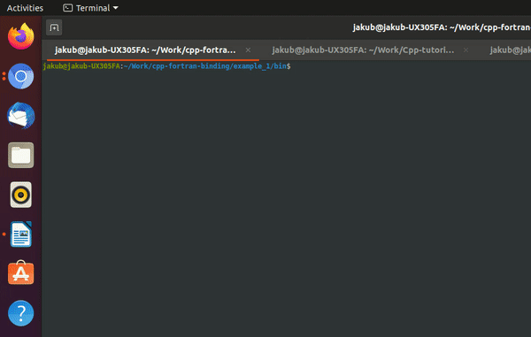
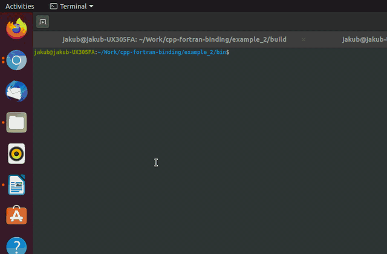

# Binding Fortran and C++ codes

This repository contains examples that demonstrate simple programs written using a combination of both Fortran and C++ languages. While the popularity of C++ is nowadays indisputably higher (mainly because of the wealth of freely available libraries and the ease of their integration with C++ codes), many high performance computing simulations still remain written in Fortran. Therefore finding ways for binding the two languages is a great way how to get the best of both of them.

A wrote a few examples below that demonstrate how Fortran codes can be binded with C++ to visualize the data using the VTK libraries. These ideas can be easily translated to larger codes with only a few extra lines of Fortran code to be added. 

# Examples

## example_1 (Fortran calls C++ function)
In this implementation, the main program is written in Fortran. The Fortran code generates data (here a simple sequence of numbers from `1` to `N*N*N`) and calls a C++ function to which it passes the data to visualize them on a cube using the VTK libraries. 

### compile the code
`mkdir build && cd build && cmake .. && make`

### run the code
`cd ../bin && ./a.out`

### demonstration
The program will ask for an integer `N`. In the demonstration below, `N=5`, the grid of 5x5x5 points is visualized.

## example_2 (Fortran calls C++ functions for ipc using shared memory)
This implementation is useful for binding a standalone fortran code (possibly running in MPI) with the VTK visualization toolkit through the interprocess communication using the shared memory. The shared memory segment is initialized by a C++ standalone code (or a function) that then calls the fortran executable (standalone) through the system call. The fortran code calls a C++ function to attach and pass data to the shared memory segment that are then read and processed by the C++ main code.  

### compile the code
`mkdir build && cd build && cmake .. && make`

### run the code
`cd ../bin && ./a.out 11`

### demonstration

